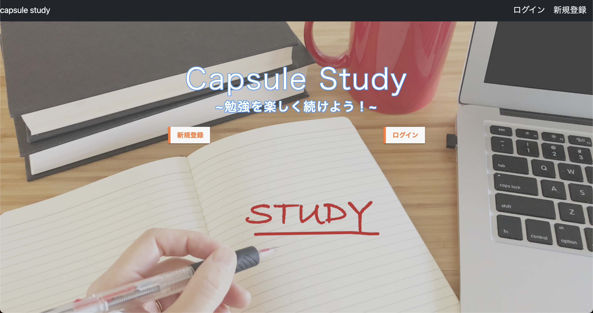
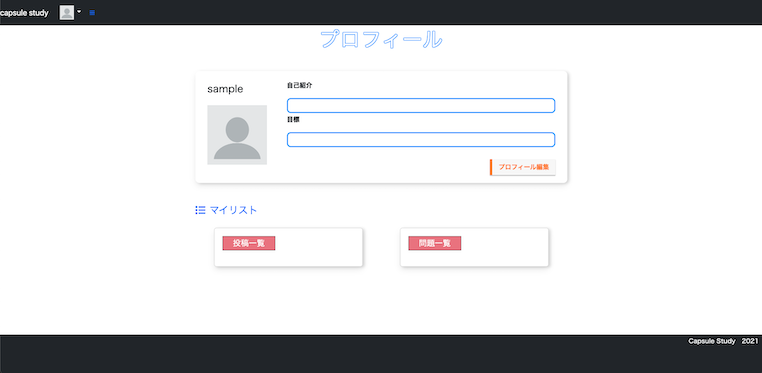
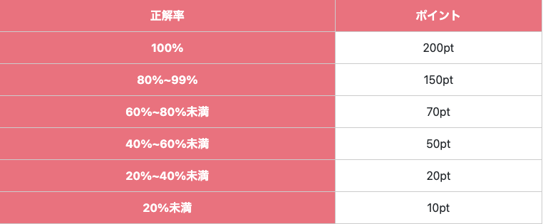

# CapsuleStudy

### アプリ説明
勉強系のWebアプリです。 
あらかじめ用意されている問題の中からランダムにテストが作成され、解答することができます。 
問題を作成し投稿できたり、逆に様々な問題を解くこともできます。 
つぶやくこともでき、勉強についての悩みや目標、情報を発信してみましょう。

### なぜ作ったか
勉強のモチベーションを維持して楽しく継続し、各個人の目標を達成して欲しいという思いから作りました。

### URL
https://capsule-study.herokuapp.com/

### テスト用アカウント
メール：example@email.com 
パスワード：capsule_study

### 利用方法

①新規登録・ログイン方法
 
トップページで新規登録または、ログインボタンをクリックしてください。 
	 

- **新規登録方法** 
  メールアドレス、ニックネーム、パスワードを入力してください。（初回登録時、500pt付与) 
	 
- **ログイン** 
  登録したメールアドレス、パスワードを入力してください。(1日1回ログイン時、100pt付与。AM5時更新）

②プロフィール画面
 

 
 
ログインするとプロフィール画面に遷移します。プロフィール画面では以下のことができます 
	 

- **プロフィール編集** 
  「プロフィール編集」ボタンをクリックすることで以下のことができます
  - ユーザーネームの編集
  - 自己紹介文の作成
  - 目標を記入
  - ユーザー画像の編集
   
- **マイリスト確認** 
	「マイリスト」をクリックするとマイリストに登録した問題を確認できます 
   
- **投稿一覧表示** 
	投稿した内容の確認、編集、削除ができます 
   
- **問題一覧表示** 
	投稿した問題の確認、編集、削除ができます 
  

③メニュー
 
左上の三本線を押すとメニューが開き、以下のことができます 
	 

- **管理者の問題** 
	あらかじめ用意されている問題の中からランダムに10題選ばれ、解答できます。 
   
- **投稿された問題** 
	他のユーザーが作成/投稿した問題を解くことができます。 
   
- **問題作成/投稿** 
	自分で考えた問題を作成し、投稿することができます。 
   
- **お問い合わせ** 
	質問や、要望などを問い合わせることができます。 
   
- **現在のポイント** 
	現在持っているポイント数の確認ができます。 
  

④問題解答説明
 

- **ポイントについて** 
  一つの問題につき100pt消費します。 
  正解率に応じてポイントが獲得できます。獲得ポイントは以下の通りです 
   
   
   
- **制限時間** 
	制限時間は10分です 
   
- **解答方法** 
	問題は全て四肢択一問題です。 
	正解だと思うチェックボックスを一つ選択してください。(複数選択すると、不正解になります) 
	解答が終わったら、解答終了ボタンを押して解答を終了します。 
   
- **解答結果** 
	正解数と獲得ポイントが表示され、問題の正解を確認できます。 
  

### 使用技術
Ruby 3.1.2 
Ruby on Rails 6.1.3.2 
PostgreSQL 14.5 
Puma 
RSpec 
HTML&CSS 
JavaScript

### 機能一覧

### テスト

